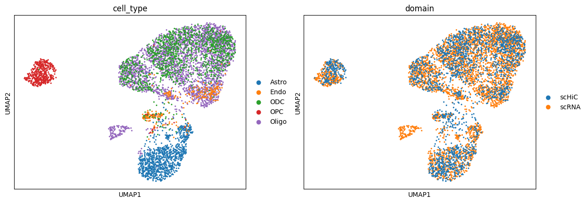

# Quickstart

This page presents a minimal workflow to get you started in using SCCE. The goal is **not** to produce a ready-to-use predict model but to familiarize yourself with the main SCCE concepts.

## Step 0: Install SCCE

```bash
conda create -n scce python=3.8 libffi=3.3
conda activate scce
pip install scce
```

## Step 1: Prepare the data

The entire workflow requires the following types of data (Following the quotation marks are the recommended data for this workflow):
1. scHi-C metadata: [Lee2019 metadata(partial)](../../tests/data/hic/metadata.csv)
2. scHi-C dataset: [Lee2019](https://salkinstitute.app.box.com/s/fp63a4j36m5k255dhje3zcj5kfuzkyj1/folder/82405563291)
3. scHi-C PCA data: [BandNorm's results(partial)](../../tests/data/other/hic_pca.csv)
4. annotation file:
```
wget -c https://ftp.ebi.ac.uk/pub/databases/gencode/Gencode_human/release_19/gencode.v19.annotation.gtf.gz
gzip -d gencode.v19.annotation.gtf.gz
``` 
1. scRNA metadata: [Bakken et al. Human M1 -- 10x Genomics (partial)](../../tests/data/rna/metadata.csv)
2. scRNA expression matrix: [Bakken et al. Human M1 -- 10x Genomics (partial)](../../tests/data/rna/matrix.csv)

## Step 2: Construct map

### preprocess
```python
from scce import preprocess

preprocess.hic_process(
    metadata_path,
    hic_folder_path,
    hic_output_path,
    column_names=dict(id="sample_name", cell_type="cell_type"),
    cell_types=["Astro", "Endo", "ODC", "OPC"],
    resolution=10000,
    n_jobs=8,
)

preprocess.rna_process(
    metadata_path,
    matrix_path,
    rna_output_path,
    column_names=dict(id="sample_name", cell_type="subclass_label"),
    cell_types=["Astro", "Endo", "Oligo", "OPC"],
)
```

### integrate
```python
from scce import integrate, plot

data_tool = integrate.DataTool(hic_output_path, rna_output_path, cell_types=["Astro", "Endo", "Oligo", "ODC", "OPC"])
data_tool.add_hic_pca(hic_pca_path)
data_tool.add_gene_annotation(annotation_path, gtf_by="gene_name")

data_tool.hic_pca()
data_tool.rna_pca()
data_tool.rna_highly_variable_genes()
hic, rna = data_tool.get_data()

hic.var["chromStart"], hic.var["chromEnd"] = hic.var["start"], hic.var["end"]
graph = integrate.generate_graph(hic, rna, resolution=10000)
integrate.glue_embedding(hic, rna, graph)
map = integrate.mapping(hic, rna)

hic.write(mapped_hic_path, compression="gzip")
rna.write(mapped_rna_path, compression="gzip")
map.to_csv(mapping_path)

plot.umap(anndata.concat([rna, hic]), dict(color=["cell_type", "domain"]))
```

```{figure} _static/integrate_result.png
:align: center

Integrate Result
```

<!--  -->

## Step 3: Train the model

### generate dataset
```python
import anndata
import numpy as np
import pandas as pd

from scce.model import DataSetGenerator

map = pd.read_csv(mapping_path, index_col=0)
rna = anndata.read_h5ad(mapped_rna_path)
target_label = "PDGFRA"

generator = DataSetGenerator(map, rna, hic_folder_path, resolution=10000)
generator.generate_by_gene_name([target_label])
dataset = generator.get_dataset()
np.save(dataset_path, dataset)
```

### train
```python
import numpy as np

from scce.model import build, predict

dataset = np.load(dataset_path, allow_pickle=True).item()
target_label = "PDGFRA"

train_dataset, eval_dataset = dataset["train"], dataset["eval"]
build(dict(train=train_dataset, eval=eval_dataset), target_label=target_label)
```
Function `build` will create a `.scce` folder on the path where the command is executed to save the model checkpoint

## Step 4: Predict

```python
import numpy as np

from scce.model import predict

eval_dataset = np.load(dataset_path, allow_pickle=True).item()["eval"]
target_label = "PDGFRA"

RNA_values = [data["scRNA"] for data in eval_dataset]
evaluate = predict(target_label, RNA_values)
```

## Step 5: Analyse

### calculate chromatin remodeling factors score
```python
import numpy as np

from scce.analyse import ig_attribute

eval_dataset = np.load(dataset_path, allow_pickle=True).item()["eval"]
target_label = "PDGFRA"

RNA_values = [data["scRNA"] for data in eval_dataset if data["cell_type"] == "OPC"]
gene_names = eval_dataset[0]["scRNA_head"]
ChRFs_score = ig_attribute(target_label, RNA_values, gene_names)
ChRFs_score = ChRFs_score.sort_values(by="score", ascending=False)
```
